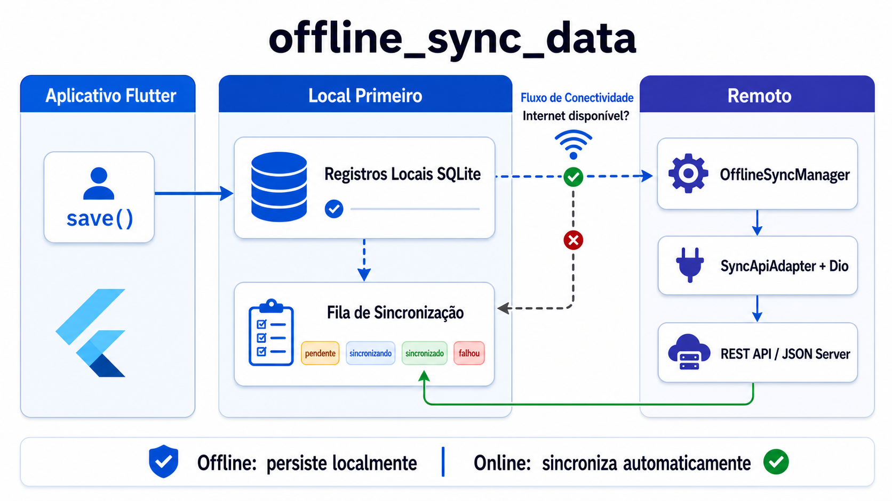

# offline_sync_data

Motor de sincronizacao offline-first para Flutter. Operacoes feitas sem acesso à internet
sao persistidas em SQLite e enviadas automaticamente ao servidor quando o dispositivo
volta a ter conectividade.

## Recursos

- Fila local persistente com `sqflite`, compativel com Android e iOS.
- Documentos locais persistentes para leitura offline e reabertura do app.
- Deteccao de internet real com `internet_connection_checker_plus`.
- Stream de conectividade com sincronizacao ao voltar online e verificacao
  periodica para cobrir transicoes nao notificadas pela plataforma.
- API desacoplada por `SyncApiAdapter`, com adapter REST opcional baseado em `dio`.
- Estados observaveis por item (`pending`, `syncing`, `synced`, `failed`),
  fila global, conectividade online/offline e varias entidades no mesmo engine.
- Retry configuravel com backoff linear (`retryCount * 2` segundos por padrao).
- Resolucao de conflitos local-wins, remote-wins e last-write-wins.
- Ponto de entrada pronto para integracao opcional com `workmanager`.

O engine persiste tanto as **operacoes de sincronizacao** quanto documentos
locais JSON. Assim, o aplicativo pode continuar lendo seus dados depois de
reiniciar sem conexao.

## Arquitetura



O fluxo e local-first: `save()` persiste o documento e a operacao na fila
SQLite antes de qualquer chamada remota. Quando o stream confirma internet
disponivel, `OfflineSyncManager` processa a fila atraves do `SyncApiAdapter`;
com `DioSyncApiAdapter`, as operacoes chegam a API REST ou ao `json-server` do
exemplo. Sem internet, os itens permanecem locais com estado `pending`.

## Instalacao

Adicione ao `pubspec.yaml` do aplicativo:

```yaml
dependencies:
  offline_sync_data: ^0.1.0
  dio: ^5.8.0
```

Para desenvolvimento local:

```yaml
dependencies:
  offline_sync_data:
    path: ../offline_sync_engine # nome da pasta do repositório
```

## Inicio rapido

Implemente o contrato da sua API ou utilize `DioSyncApiAdapter`:

```dart
final adapter = DioSyncApiAdapter(
  dio: Dio(BaseOptions(baseUrl: 'https://api.example.com')),
);

final offlineSync = OfflineSyncEngine(
  apiAdapter: adapter,
  conflictResolver: const LastWriteWinsConflictResolver(),
  options: const OfflineSyncOptions(maxRetries: 3),
);

await offlineSync.initialize();
offlineSync.syncManager.startAutoSync();
```

Salve uma acao local antes de depender da rede:

```dart
await offlineSync.save(
  entity: 'tasks',
  id: task.id,
  data: task.toJson(),
  operation: SyncOperation.create,
);
```

O mesmo metodo aceita `SyncOperation.update` e `SyncOperation.delete`.
Uma criacao ainda pendente e nunca tentada seguida de alteracao vira uma unica
criacao com o payload novo; seguida de remocao, ela e retirada da fila. Depois
de uma tentativa, remocoes sao sincronizadas explicitamente, pois a resposta
do servidor pode ter falhado apos aceitar a criacao.

Leia os registros locais, inclusive offline:

```dart
final records = await offlineSync.getRecords('tasks');
final tasks = records.map((record) => Task.fromJson(record.data)).toList();

offlineSync.watchRecords('tasks').listen((records) {
  // Reconstrua a interface a partir dos documentos locais persistidos.
});
```

`create` e `update` gravam o documento local junto com a fila, em uma mesma
transacao. `delete` remove o documento local imediatamente e preserva a
operacao pendente para remocao na API.

Sincronize manualmente quando quiser forcar o envio:

```dart
await offlineSync.syncManager.syncNow();
```

## Estado da sincronizacao, conectividade e dados pendentes

O engine separa dois conceitos:

| Conceito            | O que representa                                                  | Como observar                   |
| ------------------- | ----------------------------------------------------------------- | ------------------------------- |
| **Documento local** | Dado da aplicacao persistido para leitura offline (`LocalRecord`) | `getRecords`, `watchRecords`    |
| **Item da fila**    | Operacao ainda nao reconciliada com o servidor (`SyncQueueItem`)  | `watchQueue`, `watchItemStatus` |

Um registro pode existir localmente **sem** entrada na fila: isso significa que
ja foi sincronizado (ou nunca precisou de envio). Enquanto houver item na fila
com status diferente de `synced`, o dado ainda esta pendente de reconciliacao
com a API.

### Estados de cada operacao (`SyncStatus`)

Cada item na fila passa por um destes estados:

| Estado    | Significado tipico na UI                                                              |
| --------- | ------------------------------------------------------------------------------------- |
| `pending` | Aguardando rede ou proxima rodada de sync                                             |
| `syncing` | Envio em andamento para o servidor                                                    |
| `synced`  | Aceito pela API nesta rodada (historico mantido na fila)                              |
| `failed`  | Ultima tentativa falhou; `lastError` traz o motivo; retry automatico ao voltar online |

### Saber se o app esta online ou offline

Chame `startAutoSync()` na inicializacao (como no inicio rapido). Depois use
`watchConnectivity()`:

```dart
await offlineSync.syncManager.startAutoSync();

offlineSync.watchConnectivity().listen((online) {
  if (online) {
    // Internet alcancavel: auto-sync tenta enviar a fila
  } else {
    // Offline: save() continua gravando localmente
  }
});
```

Em `StreamBuilder`, `snapshot.data` fica `null` ate o primeiro evento chegar.
Trate isso na UI (por exemplo: "Verificando conexao..."), como no `example/`.

O monitor confirma **internet real** (requisicao HTTP), nao apenas Wi-Fi ligado.
Com `DioSyncApiAdapter` em desenvolvimento local, configure um endpoint da sua
API em `InternetConnectionMonitor` (veja secao Retry e conflitos).

### Ver a fila inteira e o status de um registro

```dart
// Todos os itens da fila (todas as entidades)
offlineSync.watchQueue().listen((List<SyncQueueItem> items) {
  final pendentes = items.where((i) => i.status != SyncStatus.synced);
  final sincronizados = items.where((i) => i.status == SyncStatus.synced);
});

// Apenas um ID (opcionalmente filtrado por entidade)
offlineSync.watchItemStatus(task.id, entity: 'tasks').listen((SyncStatus status) {
  switch (status) {
    case SyncStatus.pending:
    case SyncStatus.syncing:
    case SyncStatus.failed:
      // ainda pendente
    case SyncStatus.synced:
      // reconciliado com o servidor
  }
});
```

### Distinguir dados pendentes e sincronizados na lista

A forma recomendada e combinar **documentos locais** com a **fila**:

```dart
StreamBuilder<List<LocalRecord>>(
  stream: offlineSync.watchRecords('tasks'),
  builder: (context, recordsSnapshot) {
    return StreamBuilder<List<SyncQueueItem>>(
      stream: offlineSync.watchQueue(),
      builder: (context, queueSnapshot) {
        final records = recordsSnapshot.data ?? [];
        final queue = queueSnapshot.data ?? [];

        for (final record in records) {
          final matches = queue.where(
            (i) => i.id == record.id && i.entityName == 'tasks',
          );
          final queueItem = matches.isEmpty ? null : matches.last;

          final isSynced = queueItem == null ||
              queueItem.status == SyncStatus.synced;

          // isSynced == true  -> exibir como "Sincronizada"
          // isSynced == false -> exibir pending/syncing/failed
        }
        return const SizedBox.shrink();
      },
    );
  },
);
```

Resumo pratico:

- **Sincronizado**: existe em `watchRecords`, e nao ha item na fila **ou** o
  item correspondente esta com `SyncStatus.synced`.
- **Pendente**: ha item na fila com `pending`, `syncing` ou `failed`.
- **Contadores**: filtre `watchQueue()` ou cruze registros locais com a fila
  como no exemplo (`N pendentes | M sincronizadas`).

Consulta pontual sem stream:

```dart
final records = await offlineSync.getRecords('tasks');
final one = await offlineSync.getRecord('tasks', taskId);
```

Para saber o status de um ID sem reconstruir a UI, prefira `watchItemStatus`
ou filtre o ultimo snapshot de `watchQueue()` por `entityName` e `id`.

### Limpar historico da fila

Itens `synced` permanecem na fila para permitir observar sucesso. Remova quando
nao precisar mais desse historico:

```dart
await offlineSync.clearSynced();
```

## Varias colecoes (tipos de dados)

Use o parametro `entity` para distinguir cada tipo de dado. Um unico
`OfflineSyncEngine` e um unico `SyncApiAdapter` atendem todas as colecoes; cada
par `(entity, id)` tem chave propria no SQLite (`entityName::id`).

### Mesma API, rotas diferentes

Cenario comum: um servidor (`https://api.example.com`) expoe recursos em paths
distintos. Configure um `Dio` com `baseUrl` e grave cada tipo com `entity`
diferente:

```dart
final dio = Dio(BaseOptions(baseUrl: 'https://api.example.com'));

final offlineSync = OfflineSyncEngine(
  apiAdapter: DioSyncApiAdapter(dio: dio),
);

// Grava localmente e enfileira — cada save() escolhe a rota pelo entity
await offlineSync.save(
  entity: 'tasks',
  id: task.id,
  data: task.toJson(),
  operation: SyncOperation.create,
);

await offlineSync.save(
  entity: 'notes',
  id: note.id,
  data: note.toJson(),
  operation: SyncOperation.create,
);

await offlineSync.save(
  entity: 'customers',
  id: customer.id,
  data: customer.toJson(),
  operation: SyncOperation.update,
);
```

Com o `DioSyncApiAdapter` padrao, o envio na sincronizacao fica assim:

| `entity`    | create            | update / delete                  | fetch remoto (conflitos) |
| ----------- | ----------------- | -------------------------------- | ------------------------ |
| `tasks`     | `POST /tasks`     | `PUT` ou `DELETE /tasks/:id`     | `GET /tasks/:id`         |
| `notes`     | `POST /notes`     | `PUT` ou `DELETE /notes/:id`     | `GET /notes/:id`         |
| `customers` | `POST /customers` | `PUT` ou `DELETE /customers/:id` | `GET /customers/:id`     |

Todas as chamadas usam o mesmo host (`baseUrl` do Dio); apenas o path muda.

### Rotas que nao seguem `/<entity>/<id>`

Quando o backend usa convencoes diferentes no **mesmo host**, mapeie cada
`entity` em `resourcePathBuilder`:

```dart
final adapter = DioSyncApiAdapter(
  dio: dio,
  resourcePathBuilder: (entity, [id]) => switch (entity) {
    'tasks' =>
      id == null ? '/api/v2/todos' : '/api/v2/todos/${Uri.encodeComponent(id)}',
    'notes' => id == null ? '/notes' : '/notes/${Uri.encodeComponent(id)}',
    'profile' => '/v1/me',
    _ => id == null
        ? '/${Uri.encodeComponent(entity)}'
        : '/${Uri.encodeComponent(entity)}/${Uri.encodeComponent(id)}',
  },
);

final offlineSync = OfflineSyncEngine(apiAdapter: adapter);
```

O engine continua a passar `entity` e `id` em cada operacao; o adapter traduz
para o path correto da sua API.

### Rotas com query string (`tasks?id=2`)

Se o backend identifica o recurso na query em vez do path (`GET /tasks?id=2`,
`PUT /tasks?id=2`), devolva o path **com a query** no `resourcePathBuilder`.
O `DioSyncApiAdapter` usa essa string diretamente no pedido:

```dart
String tasksPath(String entity, [String? id]) {
  final base = '/${Uri.encodeComponent(entity)}';
  if (id == null) return base;
  return '$base?id=${Uri.encodeQueryComponent(id)}';
}

final adapter = DioSyncApiAdapter(
  dio: dio,
  resourcePathBuilder: (entity, [id]) => switch (entity) {
    'tasks' || 'notes' => tasksPath(entity, id),
    _ => id == null
        ? '/${Uri.encodeComponent(entity)}'
        : '/${Uri.encodeComponent(entity)}/${Uri.encodeComponent(id)}',
  },
);
```

Com `entity: 'tasks'` e `id: '2'`, a sincronizacao chama:

| Operacao | Metodo e URL (relativa ao `baseUrl`)       |
| -------- | ------------------------------------------ |
| create   | `POST /tasks` (body JSON; sem `id` na URL) |
| update   | `PUT /tasks?id=2`                          |
| delete   | `DELETE /tasks?id=2`                       |
| fetch    | `GET /tasks?id=2`                          |

O `id` do registo continua a ser o segundo argumento de `save()` e o valor
gravado no SQLite; apenas a URL remota muda de formato. Para varios tipos no
mesmo host, reutilize o helper ou defina um `switch` por `entity`.

Se a API exigir outros parametros (`tasks?id=2&tenant=acme`), inclua-os na
string devolvida pelo builder ou implemente um `SyncApiAdapter` customizado com
`dio.get(path, queryParameters: {...})`.

### Leitura local e fila por tipo

Documentos locais sao lidos **por colecao**:

```dart
final tasks = await offlineSync.getRecords('tasks');
final notes = await offlineSync.getRecords('notes');

offlineSync.watchRecords('tasks').listen((_) { /* UI de tarefas */ });
offlineSync.watchRecords('notes').listen((_) { /* UI de notas */ });
```

A fila de sincronizacao e **global** (todos os tipos misturados). Filtre na UI
ou em logica de negocio:

```dart
offlineSync.watchQueue().listen((items) {
  final taskQueue = items.where((i) => i.entityName == 'tasks');
  final noteQueue = items.where((i) => i.entityName == 'notes');
});

offlineSync.watchItemStatus(note.id, entity: 'notes').listen((status) {
  // pending, syncing, synced ou failed apenas desta nota
});
```

### Ordem de envio e armazenamento

- **Armazenamento:** `tasks` e `notes` nao colidem; a chave interna e
  `entityName::id` (o mesmo `id` em entidades diferentes e permitido).
- **Sync:** numa rodada, a fila e processada por ordem de `createdAt`, um item
  de cada vez, sem prioridade por tipo. Se criou uma task e depois uma note, a
  task e enviada primeiro.
- **Conectividade:** o monitor costuma verificar um endpoint (ex. `GET /tasks`).
  Enquanto esse host responder, toda a fila tenta sincronizar, incluindo
  `notes` e `customers` no mesmo servidor.

### APIs em hosts diferentes

Se cada tipo apontar para um **dominio distinto** (`api-tasks.com` e
`api-notes.com`), implemente um `SyncApiAdapter` customizado que escolha URL ou
cliente HTTP conforme o `entity` em `create`, `update`, `delete` e
`fetchRemote`. O engine nao exige um adapter por tipo — apenas que o adapter
roteie pelo nome da entidade.

## Adapter customizado

O package nao determina URLs nem formato do backend:

```dart
class TasksApiAdapter implements SyncApiAdapter {
  @override
  Future<Map<String, dynamic>> create(
    String entity,
    Map<String, dynamic> data,
  ) async {
    // POST na API da aplicacao.
    throw UnimplementedError();
  }

  @override
  Future<Map<String, dynamic>> update(
    String entity,
    String id,
    Map<String, dynamic> data,
  ) async => throw UnimplementedError();

  @override
  Future<void> delete(String entity, String id) async {}

  @override
  Future<Map<String, dynamic>?> fetchRemote(String entity, String id) async =>
      null;
}
```

`DioSyncApiAdapter` utiliza por padrao `POST /<entity>`, `PUT /<entity>/<id>`,
`DELETE /<entity>/<id>` e `GET /<entity>/<id>`. Passe
`resourcePathBuilder` para adequar as rotas.

## Retry e conflitos

Uma falha mantem a operacao com estado `failed`, grava `lastError` e aumenta
`retryCount` como contador historico. `maxRetries` limita as tentativas de cada
rodada; um item `failed` continua elegivel quando a rede volta ou ao chamar
`syncNow()` novamente. O backoff reinicia a cada rodada para que uma
recuperacao nao aguarde um atraso acumulado antigo:

```text
delay = attemptInCurrentRun * retryBaseDelay
```

Com o valor padrao de dois segundos, as esperas sao 2 s, 4 s e assim por
diante. Configure:

```dart
const OfflineSyncOptions(
  maxRetries: 5,
  retryBaseDelay: Duration(seconds: 2),
  connectivityCheckInterval: Duration(milliseconds: 500),
);
```

`startAutoSync()` escuta `InternetConnectionMonitor.onConnectivityChanged`
(baseado em `InternetConnection().onStatusChange` do pacote
[`internet_connection_checker_plus`](https://pub.dev/packages/internet_connection_checker_plus)).
Por padrao, tambem confirma o estado a cada intervalo de
`connectivityCheckInterval` (500 ms por padrao nas opcoes). Use
`connectivityCheckInterval: null` para depender apenas do stream do monitor.
Quando a internet volta, qualquer espera de retry em curso e interrompida e o
envio e tentado imediatamente.

Antes de cada chamada remota (`fetchRemote`, `create`, `update` ou `delete`),
o manager confirma que ainda existe conectividade. Se a ligacao cair durante
uma requisicao, assim que o monitor indicar offline a operacao volta para
`pending`, sem consumir uma tentativa; ela sera enviada quando a rede retornar.

O monitor verifica alcance HTTP real (nao apenas Wi-Fi). Endpoints padrao
incluem `one.one.one.one`, `icanhazip.com` e `captive.apple.com`. Para fazer o
estado online refletir a disponibilidade do backend, defina o endpoint da API:

```dart
OfflineSyncEngine.withDependencies(
  apiAdapter: adapter,
  storage: storage,
  connectivity: InternetConnectionMonitor(
    connection: InternetConnection.createInstance(
      useDefaultOptions: false,
      customCheckOptions: [
        InternetCheckOption(
          uri: Uri.parse('http://10.0.2.2:3000/tasks'),
          timeout: Duration(milliseconds: 500),
          responseStatusFn: (response) =>
              response.statusCode >= 200 && response.statusCode < 300,
        ),
      ],
    ),
  ),
);
```

Operacoes encontradas como `syncing` ao iniciar uma nova rodada sao
recuperadas automaticamente, cobrindo encerramento do app durante um envio.
Em operacoes `create`, o adapter consulta o ID remoto antes de repetir o envio;
se ele ja existir, a carga local e reconciliada com `update`, evitando um
segundo `POST` apos uma resposta perdida.

Para updates, ao fornecer um `ConflictResolver`, o manager busca o registro
remoto antes do envio e resolve o payload:

```dart
const LocalWinsConflictResolver();
const RemoteWinsConflictResolver();
const LastWriteWinsConflictResolver(); // compara o campo updatedAt
```

## Background sync

O package nao adiciona uma dependencia obrigatoria de execucao em background.
Integre a biblioteca escolhida pelo app, como `workmanager`, e invoque:

```dart
final scheduler = BackgroundSyncScheduler(offlineSync.syncManager);
await scheduler.execute();
```

O callback em background deve inicializar o Flutter e criar/inicializar o
engine antes dessa chamada, conforme as regras do plugin utilizado.

## Estrutura

```text
lib/
  offline_sync_data.dart
  src/
    background/
    connectivity/
    conflict/
    core/
    database/
    models/
    sync/
example/
  lib/main.dart
test/
```

O app em `example/lib/` demonstra `watchConnectivity()`, `watchRecords` +
`watchQueue()` e varias entidades documentadas acima. A API local fica em
`example/json-server` (`npm install` e `npm start`).

## Autor

**Celestino Lopes**

<p align="left">
  <a href="https://github.com/celestinolopes" target="_blank" rel="noopener noreferrer" title="GitHub">
    
  </a>
  &nbsp;&nbsp;
  <a href="https://www.linkedin.com/in/celestino-lopes-0817001a0/" target="_blank" rel="noopener noreferrer" title="LinkedIn">
    
  </a>
</p>

- GitHub: [github.com/celestinolopes](https://github.com/celestinolopes)
- LinkedIn: [linkedin.com/in/celestino-lopes-0817001a0](https://www.linkedin.com/in/celestino-lopes-0817001a0/)
